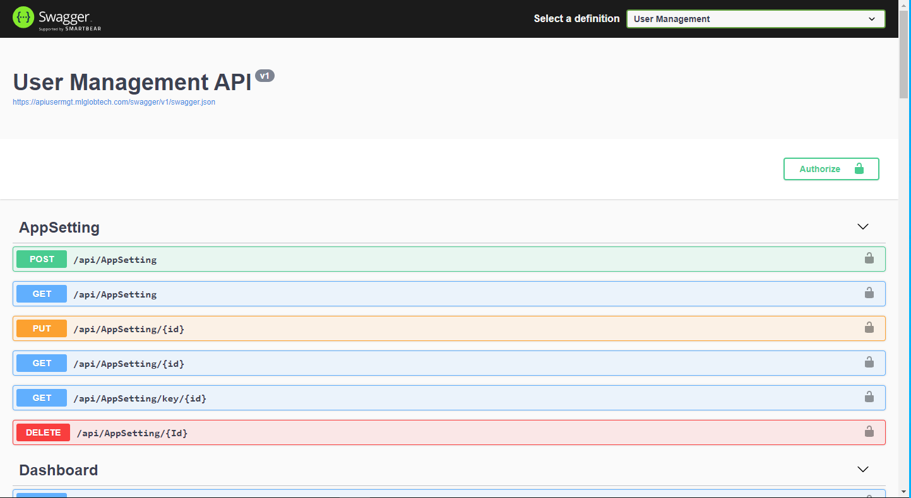

User  Management:
===========

The product is being developed and supported by the professional team since 2020.

This project runs on ASP.NET 5.0 with an MS SQL 2012 (or higher) backend database.

This project is cross-platform, and you can run it on Windows, Linux, or Mac.

All methods in user management project are async.

User Management project supports token base authentication.

User Management project architecture follows well-known software patterns and the best security practices. The source code is fully customizable. Pluggable and clear architecture makes it easy to develop custom functionality and follow any business requirements.

Using the latest Microsoft technologies, User Management project provides high performance, stability, and security.

##  Installation Guide ##
### Prerequisites ###
.NET 5.0 SDK and VISUAL STUDIO 2019, SQL SERVER

### Installation steps ###
1. Open  solution file `UserManagement.sln` from .Net core folder into visual studio 2019.
2. Right click on solution explorer and ` Restore nuget packages.`
3. Change database connection string in `appsettings.Development.json` in `UserManagement.API ` project. 
4. Open package manager console from  ` visual studio menu --> Tools --> nuget Package Manager --> Package Manager Console `                       
5. In package manager console, Select default project as `UserManagement.Domain`
6. Run `Update-Database` command in package manager console which create database and insert intial data.
7. From Solution Explorer, Right click on ` UserManagement.API ` project and click on ` Set as Startup Project ` from menu.
8. To run project ` Press F5`.

##  Project Structure ##
   <pre class="prettyprint">
├──UserManagement.sln/                     * projects solution
│   │
│   ├──UserManagement.API                  * REST API Controller, Dependancy configuration, Auto mapper profile 
│   │
│   ├──UserManagement.MediatR              * Command handler, Query handler, Fluent API validation
│   │
│   ├──UserManagement.Repository           * Each entity repository
│   │
│   ├──UserManagement.Domain               * Entity framework dbContext 
|   |
│   ├──UserManagement.Common               * Generic repository and Unit of work patterns
│   │ 
│   ├──UserManagement.Data                 * Entity classes and DTO classes
│   │
│   ├──UserManagement.Helper               * Utility classes

</pre>
##  Swagger API ##

                        

 